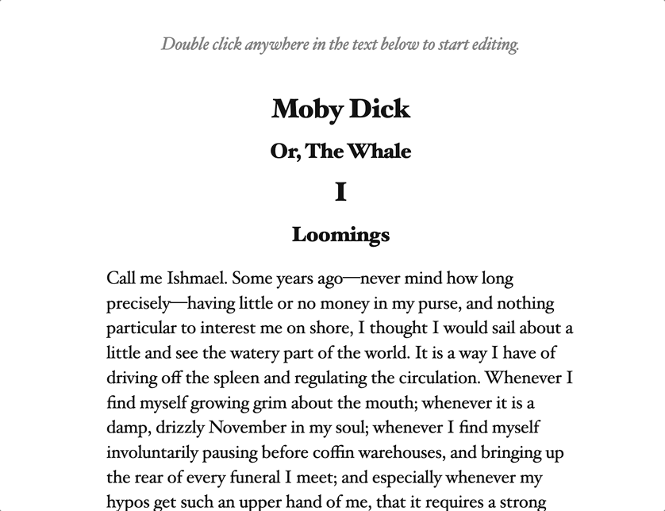

# The world-writable book

This demo lets you edit the content of a webpage in place, no web server necessary. It uses the [File System Access API](https://web.dev/file-system-access/), which will work in recent versions of Chrome, Safari, and Edge (but not Firefox).

## Why tho

 `¯\_(ツ)_/¯`

## How to use

Clone or copy this repo.

Open `index.html` by double-clicking on it. You don't need a web server!

Click on the book text to edit it. You can also highlight within a paragraph and your highlight will be persisted. Highlights can be deleted by hovering over them and clicking the delete button.

When done, click "Save changes".

When the folder dialog opens, select the folder containing this code, and then click "save."`

The `index.html` will be updated in place with your changes. No backups! Live life on the edge!

(After the first time, you won't need to go through the folder dialog again, but the browser will ask you to re-confirm that you allow file access on each save.)

 
